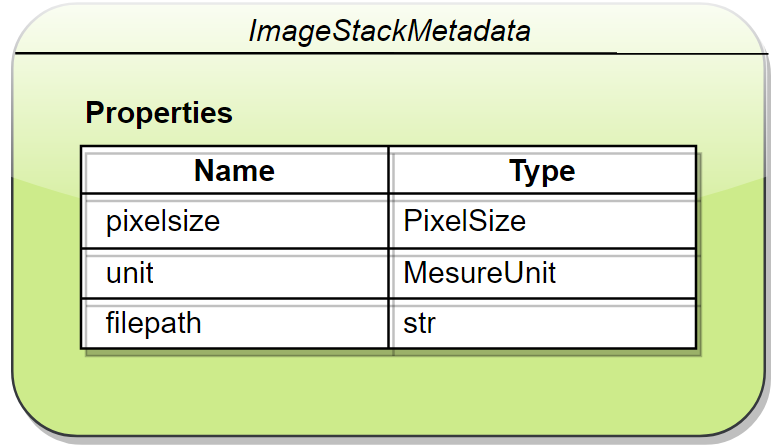

ImageStack - TIFF file
**********************

Data in a `TIFF`_ file are stored as a n-dimension matrice that correspond to the pixel values of our images (usually ranging from 0 to 255) as well as a list of metadata for additional informations (mesure units, luts, ...). 

Data
====

The shape of the matrice gives us information about the nature of the data in the file:

    TIFF/Matrice dimension representation (stack of images)

``Note: The matrice is a `numpy.ndarray`_ where the dimensions are in order `TCZYX` when the matrice is composed of 5 dimensions.``

Metadata
========

Metadata in TIFF files are stored with many specifications which makes it hard to have a universal reader to extract the metadata from .tif files. 
`Bioformats`_ is a collection of tools, developed by the `Open Microscopy Environment consortium`_, to extract data from over 150 different file formats related to biology softwares. It is a Java library, so in order to access it from python, we require the `pip`_ package `python-bioformats`_ which depends on `javabridge`_ to make the connection between Java and Python.

``Note: If you have issue loading a file, you can use your own data/metadata loader through this process: [**TODO**]``

ImageStack
==========

**Open a TIFF file with DAMAKER:**

.. code:: python

    import damaker

    stack = damaker.load('path/file.tif') # -> damaker.ImageStack
    print(stack)

**Output::**

>>> python main.py
loading data : ✔
loading metadata : ✔
shape: (2, 264, 648, 852)
format: uint8
pixelsize: X: 0.57 Y: 0.57 Z: 1.19
unit: µm
filepath: resources/E1.tif

The `damaker.load\(filepath\)`_ function takes as input a **string** containing the path to the desired file. It returns an **ImageStack** object which is the Python reprentation of our file.

**Specifications:**

    ImageStack

    ImageStackMetadata

**Example:**

.. code:: python

    import damaker
    import numpy as np

    stack = damaker.load('path/file.tif') # -> damaker.ImageStack

    stack.data # -> np.ndarray

    stack.metadata.pixelsize.X # -> float
    stack.metadata.pixelsize.Y # -> ..
    stack.metadata.pixelsize.Z # -> ..

    stack.metadata.unit       # ex: MesureUnit.micro
    stack.metadata.unit.value #     'µm'

    stack.shape() # ex: (100, 1080, 1920) ; correspond to 100 images of size 1920x1080
    stack.format() # ex: uint8 (unsigned 8-bit integer)

.. _TIFF : https://en.wikipedia.org/wiki/TIFF
.. _numpy.ndarray: https://numpy.org/doc/stable/reference/generated/numpy.ndarray.html
.. _Bioformats : https://www.openmicroscopy.org/bio-formats/
.. _Open Microscopy Environment consortium : https://www.openmicroscopy.org/about/
.. _pip : https://pypi.org
.. _python-bioformats : https://pythonhosted.org/python-bioformats/
.. _javabridge : https://github.com/CellProfiler/python-javabridge/
.. _damaker.load\(filepath\) : https://github.com/subski/DAMAKER/blob/6adc397895f0314df6699893c392734624fe1217/damaker/__init__.py#L56